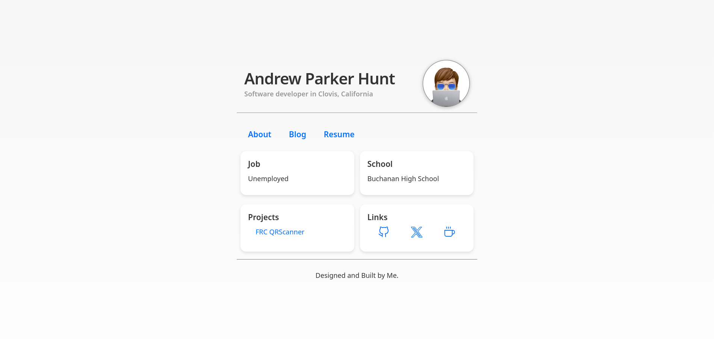

# parkerhunt.me
My personal website.

  

## About
Built using [Zola](https://www.getzola.org/) a static site engine, which allows me to create basic static pages using HTML and SCSS, while organizing and streamling the proccess of creating blog posts as markdown (.MD) files.

You can view the site in action [here](https://parkerhunt.me).

### Goal of the site
- Be rust based. - Zola is rust based, so it works out. (Although no Rust code is actually neccesary for the site, because Zola handles everything.)
- Static Site Generation - I wanted static site generation, so that the contnent of the site is pre-built at compile time. This eliminates the need for dynamic processing or database management. This allows allows the site to be extremely fast, lightweight and performant with little overhead.
- Markdown Blog Posts - Zola was a no brainer for this.
- RSS Feed. (I intend to implement this, but have yet to look into it.)
